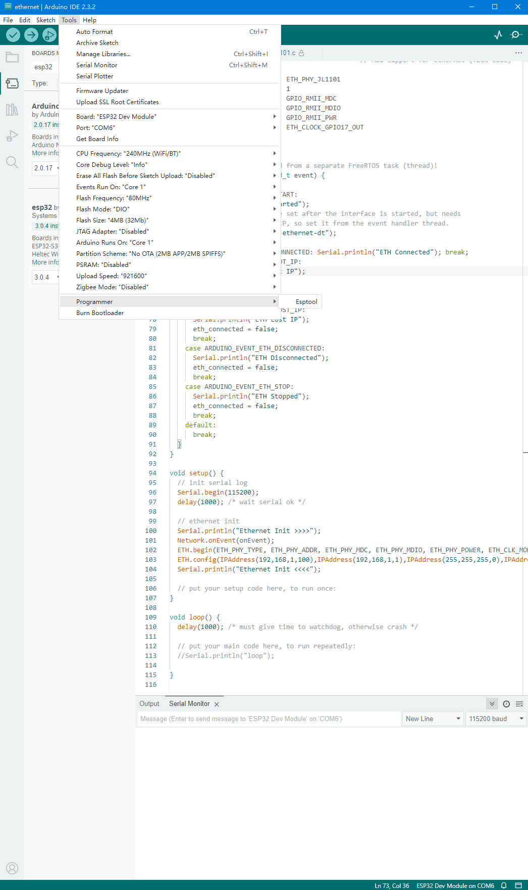
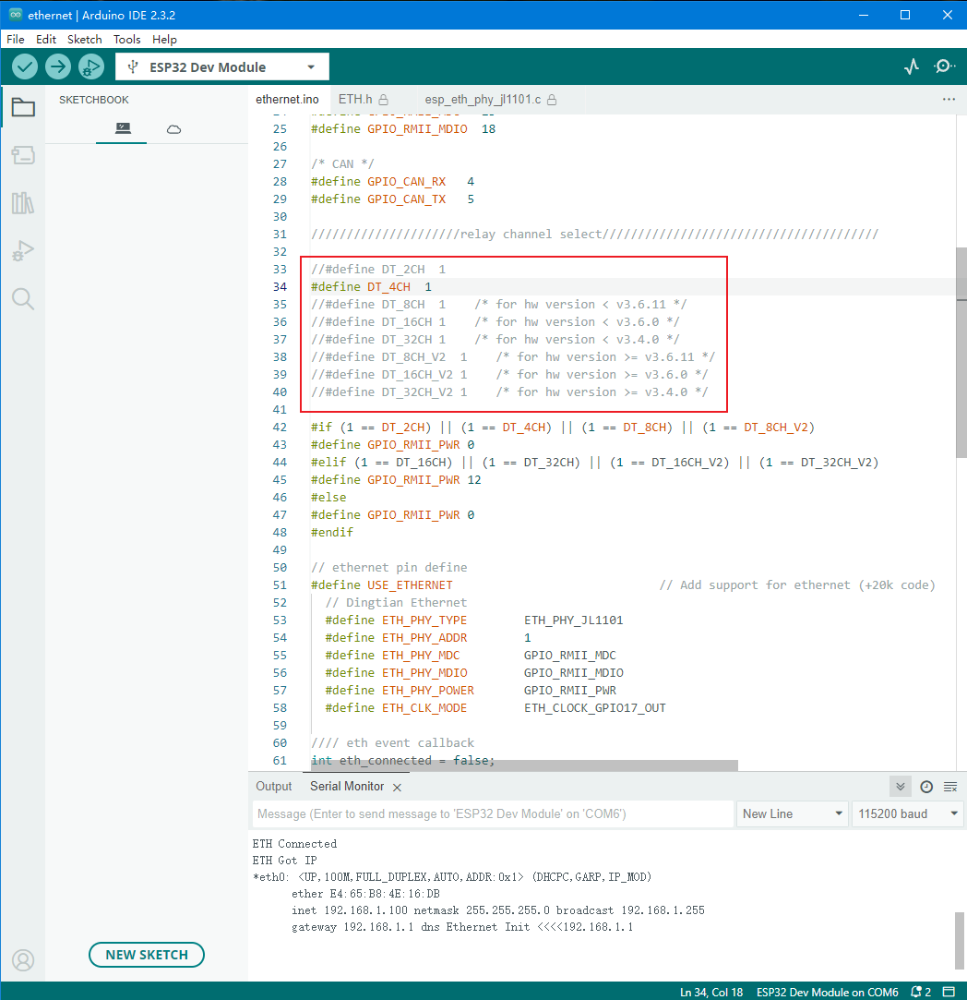

# relay_arduino_demo
 Dingtian relay board demo source and patch for Arduino

## step 1 patch
- [how to patch](patch/README.md)

## step 2 compile ethernet demo
### 1 open "ethernet" demo
### 2 config Arduino for Dingtian Relay Board

### 3 select right channel relay board
example is 4 channel relay board

### 4 Verify and Upload firmware to relay board

### 5 test ethernet is ok, default ethernet IP 192.168.1.100

