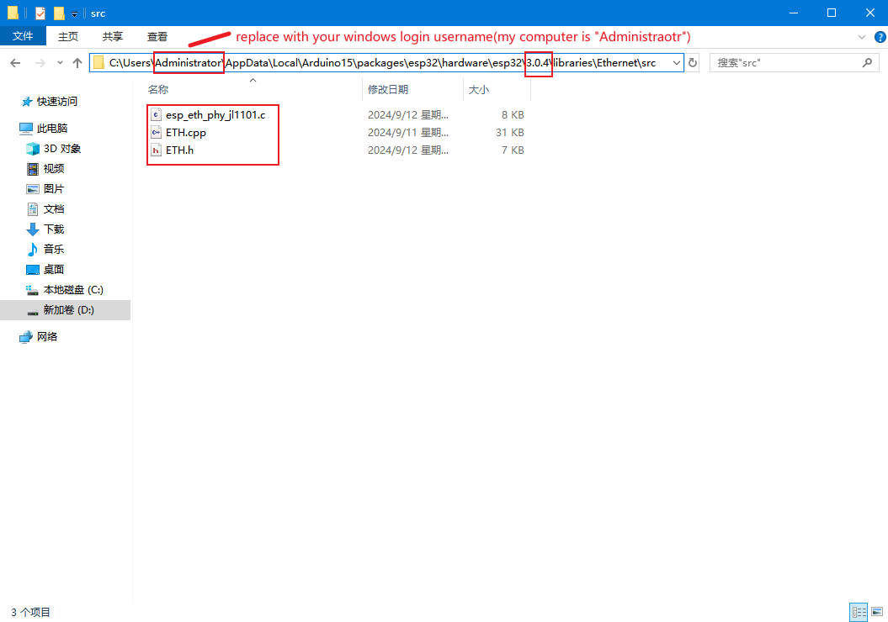

# Ethernet patch for Arduino
- Arduino esp32 sdk version: **v3.0.4**

## copy patch files to Arduino ESP32 "Ethernet"  library
- replace folder "C:\Users\\**Administrator**\AppData\Local\Arduino15\packages\esp32\hardware\esp32\3.0.4\libraries\Ethernet\src" with [github Ethernet patch folder](Ethernet/src).  
**please replace "Administrator" with your windows username.**  
result should like below image:  

